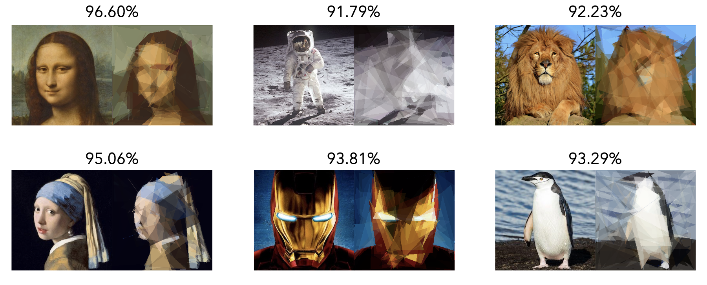

# Geometric Art
Hill-climbing optimization to represent images using geometric shapes. Based on the idea from [Roger Alsing's Genetic Programming: Evolution of Mona Lisa](https://rogerjohansson.blog/2008/12/07/genetic-programming-evolution-of-mona-lisa/) with some improvements from [AlteredQualia's Evolution of Mona Lisa in Javascript](https://alteredqualia.com/visualization/evolve/).

## Examples

Left original, right generated. All images were created using 300,000 iterations and 50 polygons. The number of sides was kept fixed at 6. Percentage above represents the similarity between the original and the generated. The similarity is computed as the absolute difference between both images.

    

