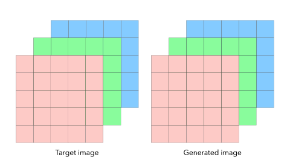
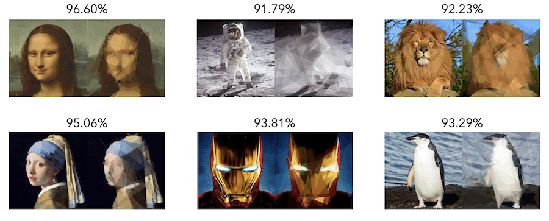
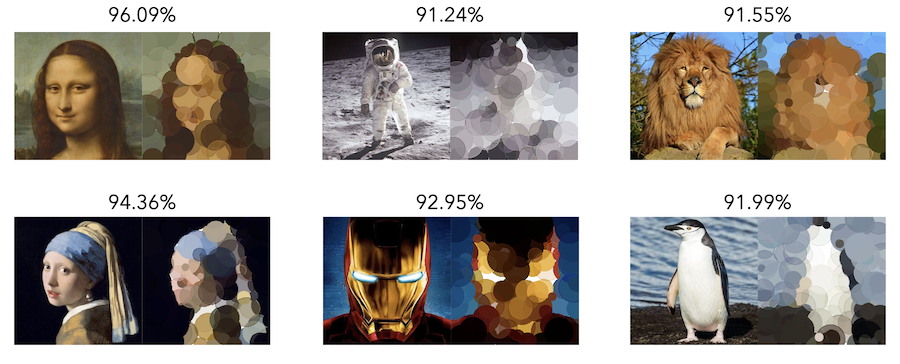

# Geometric Art
Hill-climbing optimization for representing images using semitransparent geometric shapes, including polygons and circles. Based on the idea from [Roger Alsing's Genetic Programming: Evolution of Mona Lisa](https://rogerjohansson.blog/2008/12/07/genetic-programming-evolution-of-mona-lisa/) with some improvements from [AlteredQualia's Evolution of Mona Lisa in Javascript](https://alteredqualia.com/visualization/evolve/).

<p align="center">
    
</p>


## How does it work?

The optimization starts by generating polygons or circles on the canvas. In each iteration, we will change the value of the position or color of a shape selected randomly. If the change produces a more similar image, we keep it. Otherwise, we discard it. By accumulating changes through iterations, we achieve a final image with a high resemblance to the target.

To calculate how good is an image, we render it and calculate its similarity to the target. First, we calculate pixel differences by subtracting both images, doing their absolute value and adding through channels, rows, and columns:

<p align="center">
    
</p>

We can calculate the similarity dividing the obtained difference by the maximal possible. We can arrange it to give a percentage ranging from 0% (maximal difference) to 100% (same images).


## Examples

Images on the left are the targets, images on the right are ones generated. All images were created using 300,000 iterations and 50 **polygons**. The number of sides was kept fixed at 6. Percentage above represents the similarity between the original and the generated. 

<p align="center">
    
</p>

The same images reproduced with **circles**. All images were created using 100,000 iterations and 100 circles.

<p align="center">
    
</p>


## Installation

To install the dependencies, run the following command:

```bash
pip install -r requirements.txt
```


## Usage

Run the program as:

```bash
python geometric_art.py path-to-image
```

By default, the program uses polygons. Alternatively, if you want to use circles run:

```bash
python geometric_art.py path-to-image -c
```

Additionally, you can change the parameters by adding the corresponding flag and value (if integer):

|        Flag        |                        Description                         | Default |
| :----------------: | :--------------------------------------------------------: | :-----: |
|   _-c, --circle_   |              Uses circles instead of polygons              |  False  |
|    _-h, --help_    |       Displays information and flags of the program        |    –    |
| _-i, --iterations_ |                    Number of iterations                    | 1000000 |
| _-m, --maxradius_  |          Specifies the maximum radius of circles           |   30    |
|   _-n, --number_   |                 Number of geometric shapes                 |   50    |
|    _-p, --plot_    |         Plots best image until current generation          |  False  |
|   _-r, --random_   |           Random seed for the number generation            |    –    |
|   _-s, --sides_    |              Number of sides for the polygons              |    6    |
|  _-v, --verbose_   | Prints current iteration, number of changes and similarity |  False  |
